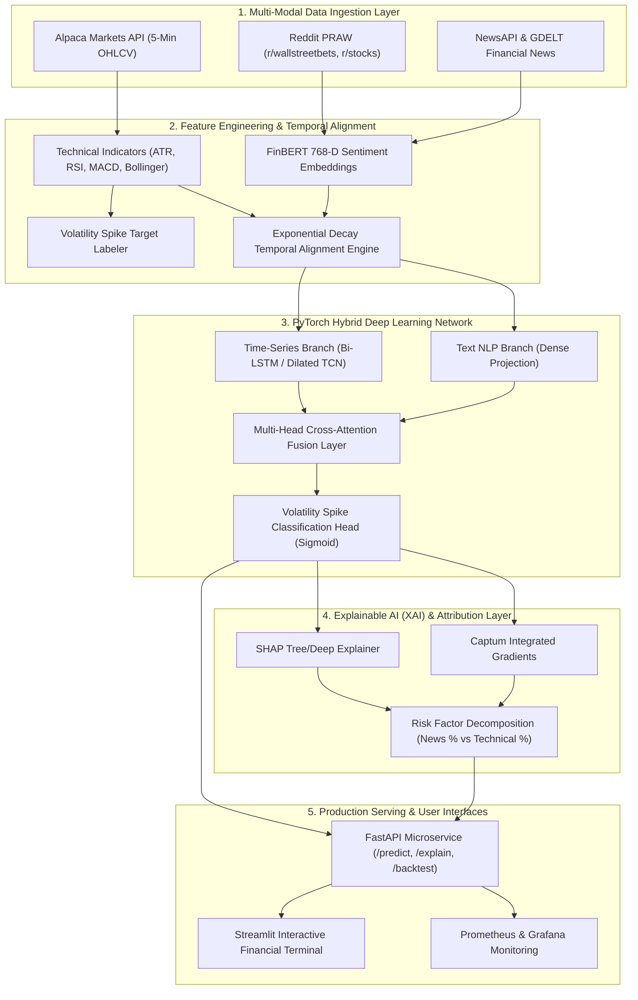

# MarketPulse AI - System Architecture 🏛️

MarketPulse AI is an enterprise-grade multi-modal artificial intelligence system designed to predict short-term financial volatility spikes ($\ge 15\%$ ATR expansion over 30 minutes) by fusing high-frequency market micro-structure with unstructured NLP sentiment signals.

---

## 🌐 End-to-End Architecture Diagram

---

## 🧩 Architectural Layers & Responsibilities

### 1. Data Ingestion Layer (`src/data_engine/`)
- Asynchronously queries market data from Alpaca Markets with automatic fallback to Yahoo Finance.
- Scrapes financial discussions from Reddit (`r/wallstreetbets`, `r/stocks`) and headlines from NewsAPI/GDELT.
- Persists raw and processed datasets into a partitioned Parquet data lake (`data/raw/` and `data/processed/`).

### 2. Feature Engineering & Alignment Layer (`src/feature_engineering/` & `src/data_alignment/`)
- Extracts non-leaking technical indicators: ATR(14), RSI(14), MACD(12,26,9), Bollinger Bands(20,2), Rolling Volatility.
- Computes FinBERT 768-dimensional CLS token embeddings.
- Aligns asynchronous text events to discrete 5-minute price bars via exponential decay:
  $$S(t) = \sum_{i} S_i \cdot e^{-\lambda(t - t_i)}$$

### 3. Deep Learning & Modeling Layer (`src/models/`)
- **Time Series Branch**: Bi-LSTM or Temporal Convolutional Network (TCN) processing historical sequences of shape `[Batch, 78, 16]`.
- **Text NLP Branch**: Dense projection module mapping 768-D FinBERT embeddings to 128-D latent space.
- **Cross-Attention Fusion**: Multi-head cross-attention mechanism enabling contextual interaction between technical dynamics and news shocks.
- **Loss Function**: Focal Loss to resolve severe class imbalance in volatility spikes.

### 4. Explainable AI Layer (`src/xai_explainer/`)
- Computes SHAP values for tabular and time-series feature contributions.
- Computes Integrated Gradients via Captum to attribute volatility spikes to specific time intervals and headlines.
- Produces institutional risk decomposition cards (e.g., 65% regulatory headline + 20% RSI divergence + 15% volume surge).

### 5. Serving & UI Layer (`src/api/` & `src/dashboard/`)
- **FastAPI**: Sub-50ms REST endpoints with Pydantic validation and Prometheus instrumentation.
- **Streamlit**: Institutional-grade dark glassmorphic terminal dashboard featuring real-time risk gauges, SHAP waterfall charts, and backtesting performance analytics.
