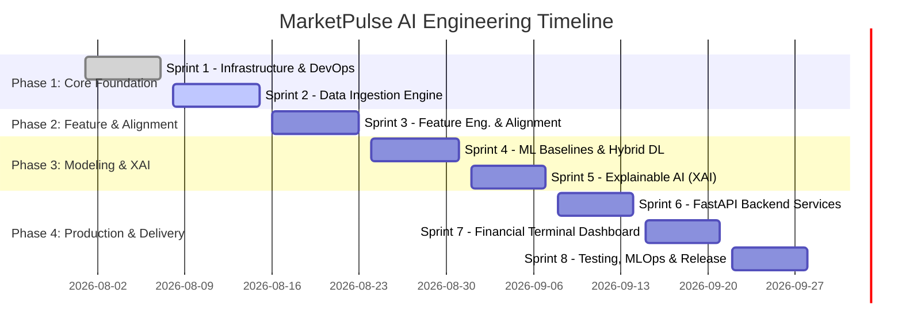

# MarketPulse AI — Project Roadmap & Milestones

This document outlines the phased development roadmap for **MarketPulse AI: Multi-Modal Financial Volatility & Market Regime Shift Prediction System**.

---

## Roadmap Overview

---

## Detailed Sprint Breakdown

### **Sprint 1: Infrastructure, Config & DevOps Engine**
- **Duration**: Week 1
- **Focus**: Enterprise project scaffolding, pydantic settings, multi-environment configs, Dockerization, and CI/CD pipelines.
- **Deliverables**:
  - Pydantic Settings & structured YAML loaders
  - Multi-stage Dockerfile and `docker-compose.yml`
  - GitHub Actions CI matrix testing (Python 3.10, 3.11)

### **Sprint 2: Data Ingestion & Storage Lake**
- **Duration**: Week 2
- **Focus**: High-throughput asynchronous time-series and sentiment collectors with Parquet storage.
- **Deliverables**:
  - Alpaca Markets 5-min OHLCV collector + Yahoo Finance fallback
  - Reddit PRAW sentiment scraper (`r/wallstreetbets`, `r/stocks`)
  - NewsAPI & GDELT headline ingestion engine
  - Partitioned Parquet Lake with data validation

### **Sprint 3: Feature Engineering & Temporal Alignment**
- **Duration**: Week 3
- **Focus**: Technical indicator extraction, FinBERT text embeddings, and mathematical exponential decay forward-fill temporal alignment.
- **Deliverables**:
  - Technical indicator suite (ATR 14, RSI, MACD, Bollinger Bands, Rolling Volatility, VWAP)
  - Ground-truth Volatility Spike labeler: $\max(\text{ATR}_{t+1:t+6}) \ge 1.15 \cdot \text{ATR}_t$
  - FinBERT 768-D CLS sentiment embeddings with batch processing
  - Vectorized Exponential Decay Alignment Engine: $S(t) = \sum S_i \cdot e^{-\lambda \Delta t}$
  - Multi-modal PyTorch Aligned Dataset & Walk-Forward DataLoader

### **Sprint 4: ML Baselines & Hybrid Deep Learning Architecture**
- **Duration**: Week 4
- **Focus**: Classical tabular baselines and the flagship PyTorch multi-modal hybrid deep learning network (`MarketPulseNet`).
- **Deliverables**:
  - HistGradientBoosting & Random Forest baselines with Purged K-Fold CV
  - Time-series encoder: Bi-LSTM & Temporal Convolutional Network (TCN)
  - NLP encoder: FinBERT projection layer
  - Multi-Head Cross-Attention Fusion layer
  - PyTorch training loop with Focal Loss & Learning Rate Warmup

### **Sprint 5: Explainable AI (XAI) & Attribution Layer**
- **Duration**: Week 5
- **Focus**: Interpretable financial machine learning and risk attribution.
- **Deliverables**:
  - SHAP TreeExplainer & DeepExplainer integrations
  - Captum Integrated Gradients & Cross-Attention heatmaps
  - Volatility Risk Factor Decomposition (e.g. 65% News Headline + 20% RSI Divergence + 15% Volume Surge)

### **Sprint 6: Production FastAPI Backend & Microservices**
- **Duration**: Week 6
- **Focus**: Ultra-low latency asynchronous REST API and model serving.
- **Deliverables**:
  - `/predict`: Real-time multi-modal volatility inference
  - `/explain`: On-demand SHAP & Integrated Gradients attribution
  - `/backtest`: Strategy execution & financial risk metrics
  - Prometheus metrics exporter & health check middleware

### **Sprint 7: Interactive Financial Terminal Dashboard (Streamlit)**
- **Duration**: Week 7
- **Focus**: Institutional-grade glassmorphic dark financial terminal.
- **Deliverables**:
  - Real-Time Volatility Monitor & Live Risk Gauge
  - Explainability Explorer with SHAP waterfall & attention visualizer
  - Backtesting Engine (Equity Curve, Drawdown, Sharpe/Sortino ratios)
  - Data & Sentiment Explorer

### **Sprint 8: Testing, MLOps & Production Release**
- **Duration**: Week 8
- **Focus**: Comprehensive unit/integration testing (>80% coverage), Kubernetes manifests, and final release.
- **Deliverables**:
  - Full automated test suite across all modules
  - Kubernetes deployment & Helm charts
  - End-to-end documentation & release v1.0.0
